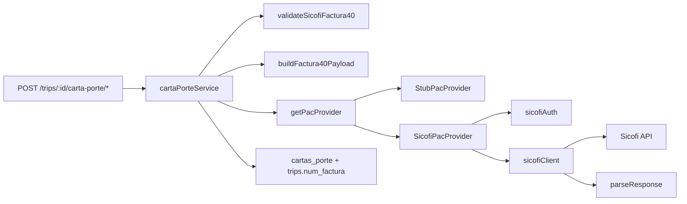

# Módulo PAC — Facturas CFDI / Carta Porte

Punto de entrada para desarrolladores del timbrado fiscal en TLO. El módulo abstrae al **Proveedor Autorizado de Certificación (PAC)** y construye el JSON para Sicofi Factura40 (CFDI 4.0 + complemento Carta Porte 3.1).

Para troubleshooting operativo detallado (catálogos SAT, tablas de errores XSD), ver [docs/sicofi-factura40.md](../../../../docs/sicofi-factura40.md).

## Qué hace el módulo

TLO no tiene un `facturaService` separado. La facturación se modela como **timbrado CFDI** dentro del flujo de Carta Porte:

| Tipo UI | `TipodeComprobante` | Descripción |
|---------|---------------------|-------------|
| **Ingreso** | `FA` | Factura con tarifa del viaje + IVA/retención |
| **Traslado** | `T` | CFDI de traslado con montos en $0 y moneda `XXX` |

El módulo `pac/` expone la interfaz `PacProvider` con dos implementaciones:

| `pac_proveedor` | Comportamiento |
|-----------------|----------------|
| `stub` (default) | Simula timbrado local sin llamar a proveedor externo |
| `sicofi` | JWT Bearer + POST JSON a `Factura40` (ingreso o traslado) |

La orquestación (validación, preview, persistencia, API) vive en [`cartaPorteService.ts`](../cartaPorteService.ts).

## Arquitectura



### Archivos en `pac/` (raíz)

| Archivo | Rol |
|---------|-----|
| `index.ts` | Factory `getPacProvider()` — elige stub o sicofi |
| `types.ts` | Contratos `PacProvider`, `TimbradoContext`, `TimbradoResult`, `TimbradoOpts` |
| `StubPacProvider.ts` | PAC simulado para desarrollo |
| `SicofiPacProvider.ts` | Implementación real: auth + Factura40 + reintento 401 |
| `README.md` | Esta guía |

### Archivos en `pac/sicofi/`

| Archivo | Rol |
|---------|-----|
| `config.ts` | URLs base, paths API, timeout HTTP |
| `sicofiAuth.ts` | `POST /auth/token` (Basic) → JWT cacheado en memoria |
| `sicofiClient.ts` | `POST Factura40` con Bearer |
| `parseResponse.ts` | Extrae XML/UUID/serie/folio de la respuesta |
| `sicofiErrors.ts` | Enriquece mensajes CP107, CFDI40106, CP131 |
| `types.ts` | Tipos JSON Sicofi (`Factura40PayloadBody`, etc.) |
| `buildFactura40Payload.ts` | Trip + tenant → JSON Factura40 |
| `validateSicofiFactura40.ts` | Validaciones pre-timbrado específicas Sicofi |
| `mapConceptos.ts` | Conceptos CFDI (ingreso con impuestos vs traslado $0) |
| `mapCartaPorte31.ts` | Complemento Carta Porte 3.1 |
| `invoiceTaxes.ts` | Cálculo IVA (16%) y retención (4%) |
| `publicoGeneral.ts` | RFC genérico `XAXX010101000`, régimen 616, `InformacionGlobal` |

## Flujo completo de timbrado

1. **Preview** (`previewCartaPorte`):
   - Carga viaje, tenant, ubicaciones, mercancías, camión, operador, cliente.
   - Ejecuta `validateCartaPorteData` (genérico) + `validateSicofiFactura40` (si `pac_proveedor === "sicofi"`).
   - Si no hay issues, construye `payload_preview` con `buildFactura40Payload`.
   - Devuelve `xml_preview` legacy (`buildCartaPorteXml`) para depuración.

2. **Timbrado** (`timbrarCartaPorte`):
   - Llama preview; si `valid === false`, lanza error con los issues unidos.
   - Verifica que la carta porte no esté ya timbrada.
   - `getPacProvider(tenant).timbrar(ctx)` → `TimbradoResult`.
   - Guarda XML en disco (`uploads/{tenantId}/cartas-porte/{tripId}.xml`).
   - Actualiza `cartas_porte` (uuid, xml, estatus, serie, folio, `pac_proveedor`).
   - Si es **ingreso**, escribe `trips.num_factura` como `{serie}-{folio}`.
   - En error: `cartas_porte.estatus = "error"`, `error_mensaje`, HTTP **502**.

3. **Cancelación** (`cancelarCartaPorte`):
   - Llama `pac.cancelar()`. Sicofi lanza *"no implementada aún"*.

## Rutas API

Definidas en [`routes/v1.ts`](../../routes/v1.ts):

| Método | Ruta | Permiso | Descripción |
|--------|------|---------|-------------|
| `POST` | `/api/v1/trips/:id/carta-porte/preview` | `cartaporte.timbrar` | Valida datos y devuelve preview sin llamar al PAC |
| `POST` | `/api/v1/trips/:id/carta-porte/timbrar` | `cartaporte.timbrar` | Timbrado real |
| `POST` | `/api/v1/trips/:id/carta-porte/cancelar` | `cartaporte.cancelar` | Cancelación (stub OK; Sicofi no implementado) |
| `GET` | `/api/v1/trips/:id/carta-porte/xml` | `cartaporte.ver` | Descarga XML timbrado |
| `GET` | `/api/v1/trips/:id/carta-porte` | `cartaporte.ver` | Estado de la carta porte |

### Body de preview / timbrar

```json
{
  "tipo": "ingreso",
  "moneda": "MXN",
  "tipo_cambio": 17.5,
  "uso_cfdi": "G03",
  "metodo_pago": "PPD",
  "forma_pago": "99",
  "condiciones_pago": "30 días",
  "iva_tasa": 0.16,
  "retencion_tasa": 0.04,
  "exento": false
}
```

- `tipo` default: `"traslado"`.
- Preview tolera body inválido (usa defaults); timbrar valida con Zod y responde 400 si falla.

### Configuración fiscal del tenant

`PATCH /api/v1/tenant/fiscal` (vía `fiscalController`):

| Campo API | Campo BD | Uso |
|-----------|----------|-----|
| `pac_proveedor` | `pac_proveedor` | `"stub"` o `"sicofi"` |
| `pac_url` | `pac_url` | Base URL Sicofi (prioridad sobre env) |
| `pac_usuario` | `pac_usuario` | Usuario Sicofi |
| `pac_token` | `pac_token_enc` | Contraseña Sicofi (cifrada al guardar) |
| `cfdi_serie` | `cfdi_serie` | Serie para traslado (default `CP`) |
| `rfc`, `razon_social`, `cp_fiscal` | — | Emisor; en traslado el receptor CFDI = RFC tenant |
| `iva_tasa_default`, `retencion_tasa_default` | — | Tasas por defecto en ingreso |
| `uso_cfdi_default`, `metodo_pago_default`, etc. | — | Defaults fiscales |

## Variables de entorno

```env
PAC_PROVIDER=stub
SICOFI_API_BASE_URL=https://demo.sicofi.com.mx/DFWSR/api
SICOFI_TIMEOUT_MS=120000
FISCAL_ENC_KEY=...
```

| Variable | Default | Uso |
|----------|---------|-----|
| `PAC_PROVIDER` | `stub` | Fallback si el tenant no tiene `pac_proveedor` |
| `SICOFI_API_BASE_URL` | demo Sicofi | Base URL cuando `tenant.pac_url` está vacío |
| `SICOFI_TIMEOUT_MS` | `120000` | Timeout para auth y Factura40 |
| `FISCAL_ENC_KEY` | — | Cifrado de `pac_token_enc` y CSD |

Resolución de URL: `tenant.pac_url` → `SICOFI_API_BASE_URL` → demo.

## Uso en desarrollo

### Modo stub (sin Sicofi)

No requiere credenciales. Por defecto `PAC_PROVIDER=stub` o tenant sin `pac_proveedor`.

```bash
# Timbrar vía API con el backend en marcha
curl -X POST http://localhost:3000/api/v1/trips/{tripId}/carta-porte/timbrar \
  -H "Authorization: Bearer ..." \
  -H "Content-Type: application/json" \
  -d '{"tipo": "traslado"}'
```

### Modo Sicofi

1. Configurar tenant: `pac_proveedor: "sicofi"`, `pac_usuario`, `pac_token`, opcionalmente `pac_url`.
2. Alinear `tenant.rfc`, razón social y `cp_fiscal` con el CSD cargado en Sicofi.
3. Preview antes de timbrar para ver issues sin gastar folio.

### Scripts de prueba

```bash
cd backend

# Spike: auth + timbrado directo (sin BD)
SICOFI_USUARIO=demo@mail.com SICOFI_CONTRASENA=secret \
  npx tsx scripts/sicofi-spike.ts --tipo ingreso

# Genera curl equivalente al request Factura40
npx tsx scripts/sicofi-dump-curl.ts
```

## Integración Sicofi actual

### Autenticación híbrida (2 pasos)

| Paso | Endpoint | Auth | Body |
|------|----------|------|------|
| 1. Token | `POST {base}/auth/token` | `Authorization: Basic base64(usuario:contraseña)` | vacío |
| 2. Timbrado | `POST {base}/Comprobante40/Factura40` | `Authorization: Bearer <JWT>` | JSON con `Usuario`, `Contrasena`, `DatosCFDI40`, … |

- El JWT se cachea en memoria por `{baseUrl}:{usuario}` con TTL = `expires_in - 60s`.
- Si Factura40 responde **401**, se invalida el cache y se reintenta **una vez** con token fresco.
- `pac_token` en la API es la **contraseña** Sicofi (no un JWT); se guarda cifrada como `pac_token_enc`.

### Variantes de comprobante

| Aspecto | Ingreso (`FA`) | Traslado (`T`) |
|---------|----------------|----------------|
| Montos | tarifa + IVA − retención | $0 |
| Moneda | MXN (o override) | `XXX` |
| Serie | `A` | `tenant.cfdi_serie` o `CP` |
| UsoCFDI | `G03` (o default tenant) | `S01` fijo |
| Receptor RFC | Cliente (no `XAXX` con CP) | **Mismo RFC que el emisor** (`tenant.rfc`) |
| Carta Porte | Sí (complemento 3.1) | Obligatorio |
| `num_factura` en trip | Se escribe al timbrar | No aplica |

### Respuesta exitosa

- XML del CFDI timbrado (a veces envuelto en JSON con campo `Xml`).
- Se extrae `UUID` y `FechaTimbrado` de `TimbreFiscalDigital`.
- Sin `folio_cfdi` previo, TLO envía `Folio: 1` (Sicofi no auto-asigna con `0`).
- `DatosCFDI40.Fecha` → fecha/hora SAT válida al momento del timbrado (`localDateTimeSatStr`, TZ del proceso).

## Errores comunes

### Validación en preview (antes de llamar al PAC)

TLO valida en `previewCartaPorte` y devuelve `issues[]` sin timbrar:

- Credenciales PAC faltantes (`pac_usuario`, `pac_token_enc`).
- RFC inválido en cliente, operador o ubicaciones.
- Ubicaciones sin colonia/municipio (o clave SAT).
- Mercancías sin clave `c_ClaveProdServCP` válida en catálogo importado, unidad o peso.
- `material_peligroso` incoherente con el catálogo SAT (clave con valor `0`/`1`/`0,1`).
- Ingreso con tarifa ≤ 0.
- Ingreso + Carta Porte con RFC `XAXX010101000` (público en general no permitido).
- Traslado sin RFC/razón social/CP fiscal del tenant.
- Camión: `config_vehicular` o `perm_sct` inválidos.
- Operador sin licencia federal.

### Errores SAT enriquecidos por TLO

`enhanceSicofiErrorMessage` añade contexto accionable:

| Código | Causa típica | Acción |
|--------|--------------|--------|
| **CP107** | En traslado el receptor CFDI ≠ RFC del CSD en Sicofi | Alinear `tenant.rfc`, razón social y CP con el certificado en Sicofi |
| **CFDI40106** | CSD del PAC no corresponde al emisor del XML | Recargar CSD correcto en Sicofi o corregir datos fiscales del tenant |
| **CP131** | `CantidadTransporta` sin `IDUbicacion` coherente en ubicaciones | TLO no envía `idubicacion` en ubicaciones; sí envía `CantidadTransporta` en mercancías |

Más síntomas XSD (serie no dada de alta, catálogos mezclados, etc.) en [docs/sicofi-factura40.md](../../../../docs/sicofi-factura40.md).

### Errores HTTP

| HTTP | Significado | En TLO |
|------|-------------|--------|
| 401 | Token JWT expirado o credenciales incorrectas | Reintento automático una vez; luego error al cliente |
| 400 | Validación SAT / payload | Mensaje de Sicofi en `error_mensaje` |
| 502 | Fallo de timbrado | `timbrarCartaPorte` captura y relanza con este código |
| Timeout | `SICOFI_TIMEOUT_MS` excedido | `"Timeout al conectar con Sicofi"` |

### Errores de configuración

| Mensaje | Solución |
|---------|----------|
| `Credenciales Sicofi no configuradas` | PATCH fiscal con `pac_usuario` y `pac_token` |
| `No se pudo descifrar la contraseña Sicofi` | Verificar `FISCAL_ENC_KEY` |
| `La carta porte ya está timbrada` | No re-timbrar; usar XML existente |

## Notas

- **Catálogo c_ClaveProdServCP**: tras `npm run db:migrate`, importar con `npm run db:import:sat-claves -- /ruta/CatalogosCartaPorte31.xls` (hoja `c_ClaveProdServCP`). Sin datos importados, el alta de mercancías y el preview fallarán por clave inexistente.
- **Cancelación Sicofi** no implementada (`SicofiPacProvider.cancelar` lanza error).
- **`buildCartaPorteXml`** solo se usa para preview/debug legacy (CFDI tipo T manual); el timbrado real usa `buildFactura40Payload` + Sicofi.
- **Un solo PAC productivo**: Sicofi. Otros proveedores requerirían nueva implementación de `PacProvider`.

## Referencias

- [docs/sicofi-factura40.md](../../../../docs/sicofi-factura40.md) — runbook operativo, catálogos, spike
- [Sicofi+ REST](https://plus.sicofi.com.mx/rest#)
- [`cartaPorteService.ts`](../cartaPorteService.ts) — orquestación y persistencia
