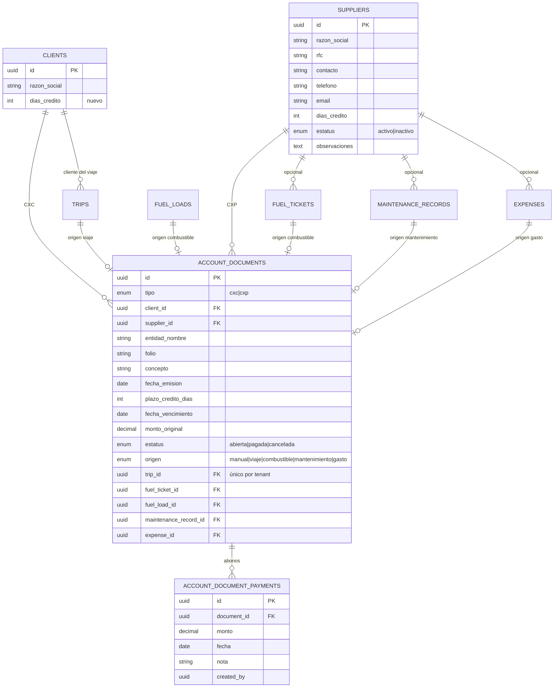
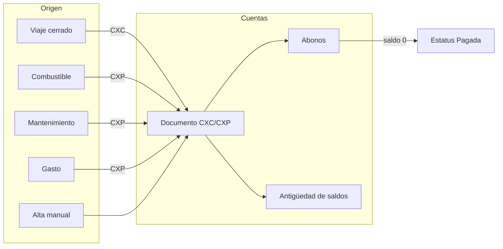
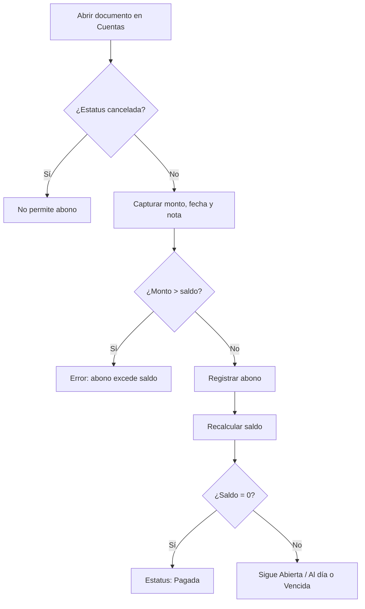

# Módulo de Cuentas por Cobrar y por Pagar (CXC / CXP)

Documento orientado al cliente — Transportes Ligeros Occidente

---

## 1. Resumen de lo nuevo

Se incorpora un módulo de **Cuentas** para controlar:

| Concepto | Significado |
|----------|-------------|
| **CXC (Por cobrar)** | Dinero que clientes le deben a la empresa (principalmente por viajes facturados) |
| **CXP (Por pagar)** | Dinero que la empresa debe a proveedores (combustible, mantenimiento, gastos, etc.) |

También se agrega el catálogo de **Proveedores** y el campo **días de crédito** en clientes y proveedores, para calcular fechas de vencimiento automáticamente.

### Pantallas nuevas

- **Cuentas** (`/cuentas`) — listado, antigüedad de saldos, alta, abonos, cancelación
- **Proveedores** (`/proveedores`) — alta y edición de proveedores

### Permisos

| Permiso | Uso |
|---------|-----|
| `cuentas.ver` | Ver documentos y antigüedad |
| `cuentas.gestionar` | Crear, editar, abonar, cancelar, sincronizar |
| `proveedores.ver` | Ver proveedores |
| `proveedores.gestionar` | Crear/editar/eliminar proveedores |

---

## 2. Diagrama entidad-relación (ER)

### Lectura del diagrama

- Un **documento** es una factura/cuenta abierta (CXC o CXP).
- Cada documento puede tener varios **abonos (pagos parciales o totales)**.
- El **saldo** = monto original − suma de abonos.
- Los documentos pueden nacer solos desde un viaje, ticket de combustible, carga de combustible, mantenimiento o gasto; o crearse a mano.
- Cada origen operativo genera **como máximo un documento** (no se duplica).

---

## 3. Cómo funciona el módulo

### 3.1 Visión general

### 3.2 Estados del documento

| Estatus interno | Qué ve el usuario | Significado |
|-----------------|-------------------|-------------|
| `abierta` | **Al día** o **Vencida** | Aún hay saldo; “Vencida” si ya pasó la fecha de vencimiento |
| `pagada` | **Pagada** | Abonos cubren el monto completo |
| `cancelada` | **Cancelada** | Anulado (solo si no tiene abonos) |

### 3.3 Antigüedad de saldos (aging)

Solo aplica a documentos **abiertos con saldo**:

| Cubeta | Criterio |
|--------|----------|
| Corriente | Sin vencer (o sin fecha de vencimiento tratada como corriente) |
| Vencido 1–30 | 1 a 30 días después del vencimiento |
| Vencido 31–60 | 31 a 60 días |
| Vencido 90+ | Más de 60 días (incluye 61–89 y 90+) |

En pantalla se muestran totales por cubeta (monto y cantidad de documentos).

### 3.4 Generación automática

| Origen | Tipo | Cuándo se crea/actualiza |
|--------|------|---------------------------|
| **Viaje** | CXC | Al cerrar el viaje (con factura y tarifa > 0), o al editar tarifa/factura/cliente de un viaje cerrado |
| **Ticket de combustible** | CXP | Al crear/actualizar el ticket |
| **Carga de combustible** (sin ticket vinculado) | CXP | Al registrar la carga en el viaje |
| **Mantenimiento** | CXP | Al crear/actualizar el registro |
| **Gasto** (tipo gasto) | CXP | Al registrar el gasto |

**Plazo de crédito:** se toma de los días de crédito del cliente (CXC) o del proveedor (CXP). La fecha de vencimiento = fecha de emisión + días de crédito.

Si no existe el proveedor al registrar combustible/mantenimiento/gasto, el sistema puede **crearlo automáticamente** a partir del nombre (gasolinera, taller, etc.).

### 3.5 Sincronizar existentes

El botón **“Sincronizar existentes”** recorre viajes, combustible, mantenimientos y gastos ya capturados y genera los documentos CXC/CXP que falten. Útil en el primer uso del módulo.

### 3.6 Edición bidireccional

Si edita un documento que nació de un viaje, combustible, etc., algunos cambios (monto, folio, proveedor/cliente, fecha) pueden **reflejarse también en el registro de origen**.

---

## 4. Proceso: añadir un documento

### Opción A — Automático (recomendado en operación diaria)

1. Configure **días de crédito** en el cliente o proveedor.
2. Realice la operación normal:
   - Cierre un viaje con factura → aparece en **Cuentas → Por cobrar**.
   - Registre combustible / mantenimiento / gasto → aparece en **Cuentas → Por pagar**.
3. Verifique en **Cuentas** el folio, monto, vencimiento y estatus.

### Opción B — Alta manual

1. Menú **Cuentas**.
2. Elija pestaña **Por cobrar (CXC)** o **Por pagar (CXP)**.
3. Clic en **Alta manual**.
4. Complete:
   - Cliente (CXC) o Proveedor (CXP)
   - Folio
   - Concepto
   - Fecha de emisión
   - Días de crédito (opcional; calcula vencimiento)
   - Monto (debe ser > 0)
5. Guardar → el documento queda **abierto / Al día**.

---

## 5. Proceso: registrar un pago (abono)

1. En **Cuentas**, abra el documento (clic en la fila).
2. Indique **Registrar abono** (o equivalente en el detalle).
3. Capture:
   - Monto (no puede superar el saldo pendiente)
   - Fecha
   - Nota opcional (referencia de transferencia, cheque, etc.)
4. Guardar.
5. El sistema recalcula:
   - **Abonos** y **Saldo pendiente**
   - Si el saldo llega a 0 → estatus **Pagada**

**Reglas importantes**

- No se pueden abonar documentos **cancelados**.
- No se puede **cancelar** un documento que ya tiene abonos.
- El monto original no puede bajar por debajo de lo ya abonado.

---

## 6. Flujo de abono (resumen visual)

---

## 7. Checklist de verificación manual

Usar este plan en ambiente de pruebas o producción controlada.

### Preparación

1. Entrar con un usuario **administrador** (o con permisos `cuentas.*` y `proveedores.*`).
2. Confirmar que aparecen en el menú: **Cuentas** y **Proveedores**.
3. (Primera vez) En **Cuentas**, pulsar **Sincronizar existentes** y anotar cuántos CXC/CXP se reportan.

### A. Proveedores y crédito

4. Ir a **Proveedores** → **Nuevo proveedor**.
5. Capturar razón social, RFC (opcional) y **días de crédito** (ej. 30). Guardar.
6. En **Clientes**, editar un cliente y asignar **días de crédito** (ej. 15). Guardar.

### B. Documento CXC automático (viaje)

7. Crear o usar un viaje con tarifa > 0 y cliente con días de crédito.
8. **Cerrar el viaje** con número de factura y fecha de llegada.
9. Ir a **Cuentas → Por cobrar**.
10. Verificar que existe un documento:
    - Origen: **Viaje**
    - Folio ≈ número de factura
    - Monto = tarifa del viaje
    - Vencimiento ≈ emisión + días de crédito del cliente
11. Abrir el detalle y confirmar enlace/concepto al servicio de transporte.

### C. Documento CXP automático

12. Registrar un **ticket de combustible** (o carga / mantenimiento / gasto) con monto > 0.
13. Ir a **Cuentas → Por pagar**.
14. Verificar documento con origen **Combustible** / **Mantenimiento** / **Gasto**, monto correcto y proveedor asociado.

### D. Alta manual

15. En CXC (o CXP) → **Alta manual**.
16. Completar folio, concepto, entidad, monto y plazo.
17. Confirmar que aparece en el listado con origen **Manual** y estatus **Al día**.

### E. Abonos parciales y total

18. Abrir un documento abierto con saldo conocido (ej. $1,000).
19. Registrar abono de **$400** → saldo debe quedar **$600**, estatus sigue abierto.
20. Registrar abono del resto **$600** → saldo **$0**, estatus **Pagada**.
21. Intentar un abono adicional → debe **rechazarse** (excede saldo).

### F. Cancelación

22. Crear un documento manual **sin abonos** → **Cancelar**.
23. Debe quedar **Cancelada** y no aceptar nuevos abonos.
24. En un documento **con abonos**, intentar cancelar → debe **rechazarse**.

### G. Antigüedad / vencidos

25. Crear o editar un documento con fecha de vencimiento **en el pasado** y saldo > 0.
26. Verificar badge **Vencida** y que el saldo aparece en la cubeta correspondiente (1–30, 31–60 o 90+).
27. Clic en la tarjeta de cubeta y confirmar que filtra la lista.

### H. Filtros y búsqueda

28. Buscar por folio / concepto / nombre de entidad.
29. Filtrar por estatus: Abierta / Pagada / Cancelada.
30. Alternar pestañas CXC ↔ CXP y confirmar que los datos no se mezclan.

### I. Permisos (opcional)

31. Con un usuario **sin** `cuentas.ver`: no debe ver el menú o debe mostrar “sin permiso”.
32. Con `cuentas.ver` pero **sin** `cuentas.gestionar`: puede ver, pero no alta/abono/sincronizar.

---

## 8. Beneficios para la operación

- Visibilidad de **quién debe y a quién se debe**, con saldos al día.
- Seguimiento de **cartera vencida** por rangos de días.
- Menos captura duplicada: los documentos salen de la operación (viajes, combustible, etc.).
- Catálogo de **proveedores** reutilizable en CXP y en registros operativos.
- Abonos parciales con historial por documento.
